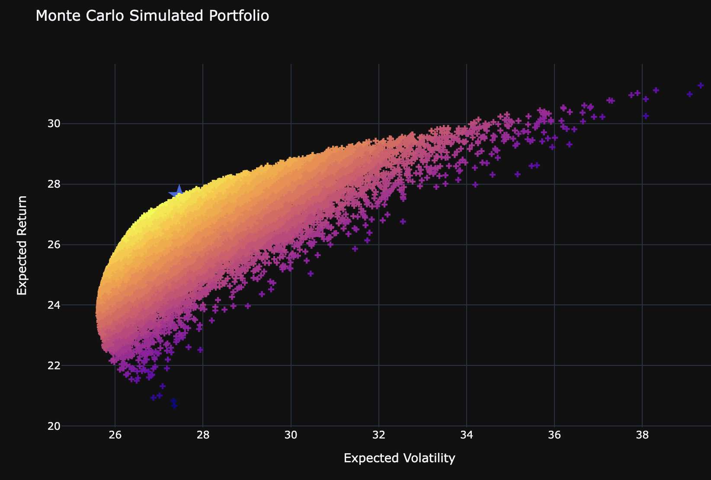
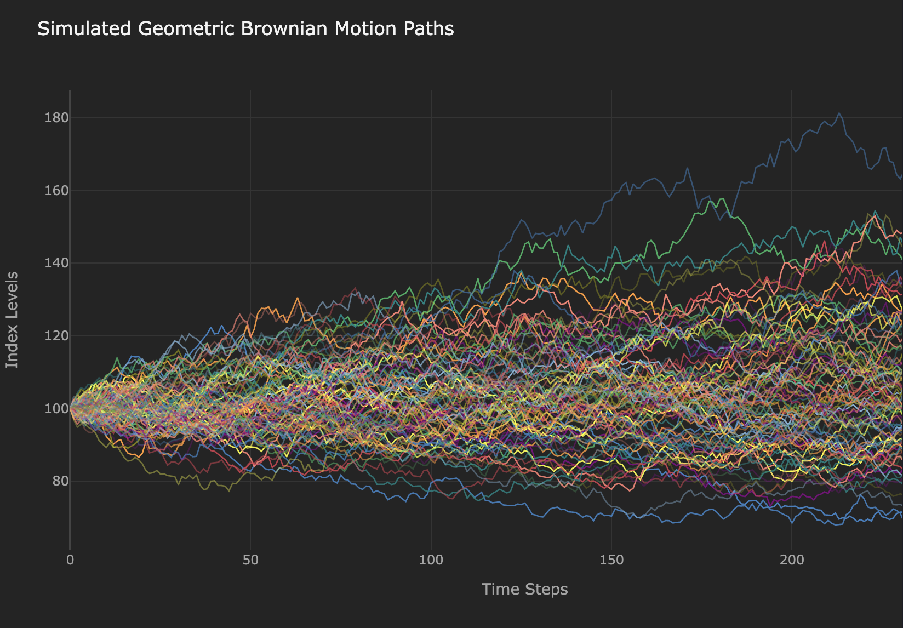
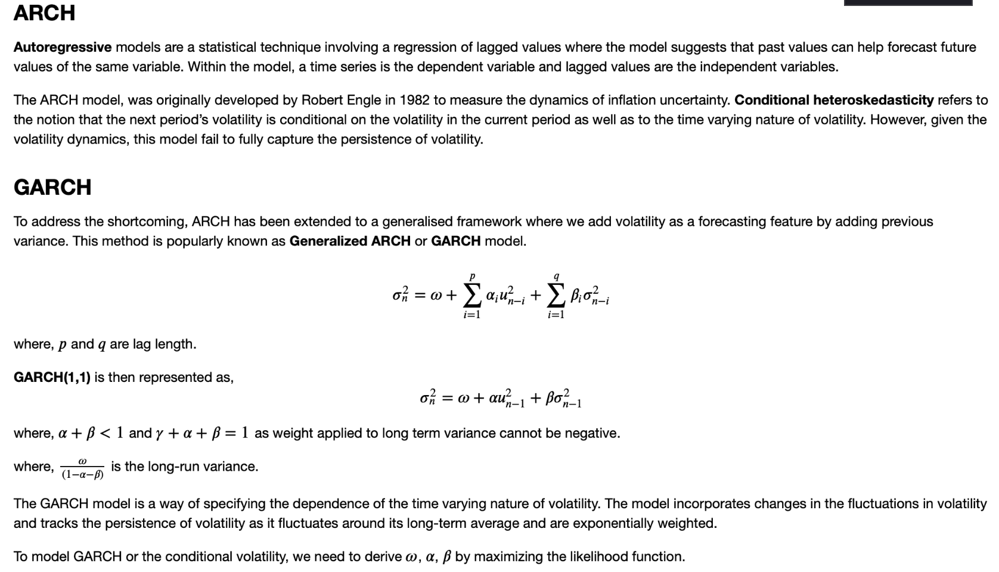
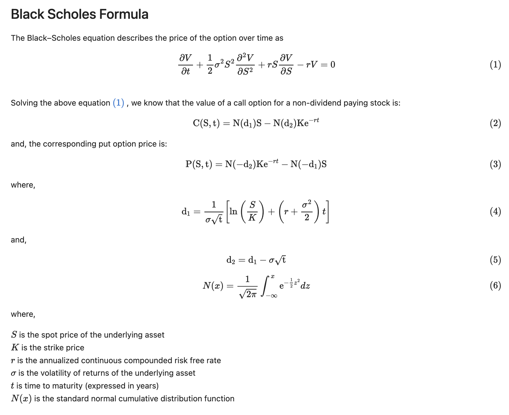

# Quantitative Finance

[Learning Pathway](https://drive.google.com/file/d/1VVrbivr5M_SjE5jK4dgTPzl_di_YtSWt/view) 

* Stochastic Calculus and Martingale Theory,
* Quantitative Risk and Return
* Equities and Currencies
* Data Science and Machine Learning
* Fixed Income and Credit

Awarded the Certificate in Quantitative Finance in November 2021

Overall mark:94%

Exam1: 84% (Portfolio Managements, Value at Risk and Basel Agreement)

Exam 2: 85% ([Binary Options Pricing in C++,](https://github.com/HigherHoopern/BinaryOptionCPP) Monte Carlo Scheme, Black-Scholes model)

Exam 3: 99% ([Predict Stock Price in Supervised Learning](https://colab.research.google.com/drive/1BuGooW9LBcOfHerVXe127EzCfE39QwgI?usp=sharing),Logistic, SVM, CART, XGB, MLP etc.)

Final Project: 100% [(Deep Learning in Time Series](https://colab.research.google.com/drive/1bNg-Lj4LYac5sITTb8aTpi5QjXITrCxg?usp=sharing),DNN, RNN, LSTM, CNN and Time Series Analysis)

Jupyter Notebooks contain

* Financial Data Source
* Binomial Tree Modelling
* Portfolio Optimisation
* Value at Risk
* ARCH and GARCH model
* Black Scholes Option Pricing
* Monte Carols Simulation
* Finite Difference Methods
* Implied Volatility

ARCH and GARCH model

BS Model

